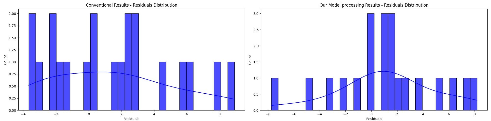

# DataDo.me: AI Data Quality Enhancer

### Yantra VIT Central Hackathon '25 Finalist and Domain Best Project

> What LLM is to chatbots, DataDo.me is to datasets


DataDo.me is an automated, end-to-end modular solution that makes the data cleaning and pre-processing tasks for your AI/ML applications a cakewalk. 

It implements hypertuned algorithms to detect and resolve duplicates, missing values, outliers, and type inconsistencies. It goes a step further and scales the data, encodes categorical values, and, even augments sparse or uniform datasets with distribution-aware synthetic samples, if needed.

### The Final Output:
A clean, consistent dataset optimized for high-performance analytics and model training.

---

### **Why DataDo.me?**

Compare and contrast the efficacy of a dataset cleaned with our tools versus conventional cleaning using final output metrics.



---

## **Key Features**

- **Duplicate Detection & Removal** using **MD5 hashing**
- **Null Value Imputation** using **KNN** for social-network type validation and diversity
- **Outlier Detection & Removal** using **DBSCAN on PCA Data** for genuine anomaly detection
- **Intelligent Type Inference & Correction** (e.g., proper datetime parsing,  sanitizing categorical numeric-string)
- **CTGAN Synthetic Data Generation** to enhance dataset diversity
---

## **Impact & SDG Contribution**

This project aligns with **SDG 9: Industry, Innovation, and Infrastructure** by enhancing data quality and infrastructure across sectors such as healthcare, agriculture, and finance. By ensuring reliable, clean datasets, DataDo.me facilitates smarter decision-making and more impactful AI models.

With today's evolving AI paradigm, this tool ensures a mere dataset will never be a road-block to your innovation!
---

## **Installation**

```bash
# Clone the repository
git clone https://github.com/m4YnK-7/DataDome.git
cd DataDome

# Install dependencies
pip install -r requirements.txt

# Start the application
python run.py
```

Access the prototype at: [http://localhost:5000](http://localhost:5000)

---

## **Future Directions**

- **Graph Neural Networks (GNNs)** to capture complex relationships for more precise cleaning
- **Domain-Specific Optimizations** for industry-specific data structures
- **Convolutional Neural Networks (CNNs)** for image dataset cleaning (Undergoing)
